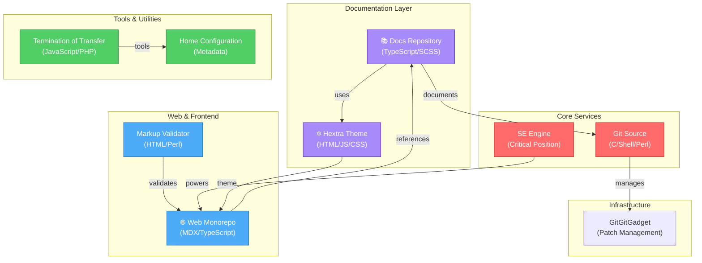

# Architecture Overview

This document provides a high-level architecture overview of the system, showing how different services and components interact.

## System Architecture

## Component Details

### Core Services
- **Git Repository**: The primary source code repository using C (50.1%), Shell (38.9%), and Perl (4.3%)
- **SE Engine**: Critical service that powers the main application functionality

### Frontend & Documentation
- **Web Monorepo**: Main web application (79.7% MDX, 17.5% TypeScript)
- **Docs**: Comprehensive documentation site (97.2% TypeScript)
- **Hextra Theme**: Modern Hugo theme for beautiful documentation (HTML, JavaScript, CSS)
- **Markup Validator**: HTML/Markup validation service

### Tools & Utilities
- **Termination of Transfer**: Transfer management tool (JavaScript, PHP)
- **Home Configuration**: System configuration and metadata

### Infrastructure
- **GitGitGadget**: Patch management and review system for git submissions

## Technology Stack

| Layer | Primary Technologies |
|-------|----------------------|
| Frontend | TypeScript, MDX, HTML, CSS, JavaScript |
| Backend | C, Shell, Perl, PHP |
| Documentation | TypeScript, MDX, HTML |
| Scripting | Python, Tcl, Perl |
| Build System | Makefile, Shell |

## Data Flow

1. **Development** → Git Repository (managed via GitGitGadget)
2. **Source Code** → SE Engine (processes core logic)
3. **Output** → Web Monorepo (frontend rendering)
4. **Validation** → Markup Validator (quality assurance)
5. **Documentation** → Docs + Hextra Theme (user-facing docs)
6. **Operations** → Transfer Tool + Home Config (system management)
