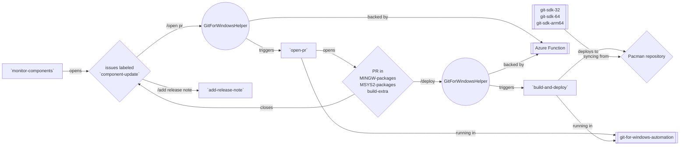
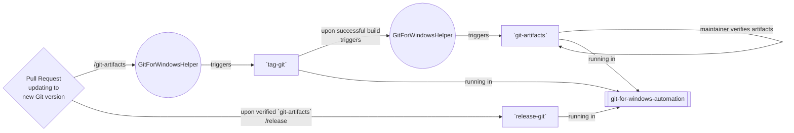

# Architecture of Git for Windows

Git for Windows is a complex project.

## What _is_ Git for Windows?

### A fork of `git/git`

First and foremost, it is a friendly fork of [`git/git`](https://github.com/git/git), aiming to improve Git's Windows support. The [`git-for-windows/git`](https://github.com/git-for-windows/git) repository contains dozens of topics on top of `git/git`, some awaiting to be "upstreamed" (i.e. to be contributed to `git/git`), some still being stabilized, and a few topics are specific to the Git for Windows project and are not intended to be integrated into `git/git` at all.

### Enhancing and maintaining Git's support for Windows

On the source code side, Git's Windows support is made a bit more tricky than strictly necessary by the fact that Git does not have any platform abstraction layer (unlike other version control systems, such as Subversion). It relies on the presence of POSIX features such as the `hstrerror()` function, and on platforms lacking that functionality, Git provides shims. That leads to some challenges e.g. with the `stat()` function which is very slow on Windows because it has to collect much more metadata than what e.g. the very quick `GetFileAttributesExW()` Win32 API function provides, even when Git calls `stat()` merely to test for the presence of a file (for which all that gathered metadata is totally irrelevant).

### Providing more than just source code

In contrast to the Git project, Git for Windows not only publishes tagged source code versions, but full builds of Git. In fact, Git for Windows' primary purpose, as far as most users are concerned, is to provide a convenient installer that end-users can run to have Git on their computer, without ever having to check out `git-for-windows/git` let alone build it. In essence, Git for Windows has to maintain a separate project altogether in addition to the fork of `git/git`, just to build these release artifacts: [`git-for-windows/build-extra`](https://github.com/git-for-windows/build-extra). This repository also contains the definition for a couple of other release artifacts published by Git for Windows, e.g. the "portable" edition of Git for Windows which is a self-extracting 7-Zip archive that does not need to be installed.

### A software distribution, really

Another aspect that contributes to the complexity of Git for Windows is that it is not just building `git.exe` and distributes that. Due to its heritage within the Linux project, Git takes certain things for granted, such as the presence of a Unix shell, or for that matter, a package management system from which dependencies can be fetched and updated independently of Git itself. Things that are distinctly not present in most Windows setups. To accommodate for that, Git for Windows originally relied on the MSys project, a minimal fork of Cygwin providing a Unix shell ("Bash"), a Perl interpreter and similar Unix-like tools, and on the MINGW project, a project to build libraries and executables using a GNU C Compiler that relies only on Win32 API functions. As of Git for Windows v2.x, the project has switched away from [MSys](https://sourceforge.net/projects/mingw/files/MSYS/)/[MinGW](https://osdn.net/projects/mingw/) (due to less-than-active maintenance) to [the MSYS2 project](https://msys2.org). That switch brought along the benefit of a robust package management system based on [Pacman](https://archlinux.org/pacman/) (hailing from Arch Linux). To support Windows users, who are in general unfamiliar with Linux-like package management and the need to update installed packages frequently, Git for Windows bundles a subset of its own fork of MSYS2. To put things in perspective: Git for Windows bundles files from ~170 packages, one of which contains Git, and another one contains Git's help files. In that respect, Git for Windows acts like a distribution more than like a mere single software application.

Most of MSYS2's packages that are bundled in Git for Windows are consumed directly from MSYS2. Others need forks that are maintained by Git for Windows project, to support Git for Windows better. These forks live in the [`git-for-windows/MSYS2-packages`](https://github.com/git-for-windows/MSYS2-packages) and [`git-for-windows/MINGW-packages`](https://github.com/git-for-windows/MINGW-packages) repositories. There are several reasons justifying these forks. For example, the Git for Windows' flavor of the MSYS2 runtime behaves like Git's test suite expects it while MSYS2's flavor does not. Another example: The Bash executable bundled in Git for Windows is code-signed with the same certificate as `git.exe` to help anti-malware programs get out of the users' way. That is why Git for Windows maintains its own `bash` Pacman package. And since MSYS2 dropped 32-bit support already, Git for Windows has to update the 32-bit Pacman packages itself, which is done in the git-for-windows/MSYS2-packages repository. (Side note: the 32-bit issue is a bit more complicated, actually: MSYS2 _still_ builds _MINGW_ packages targeting i686 processors, but no longer any _MSYS_ packages for said processor architecture, and Git for Windows does not keep all of the 32-bit MSYS packages up to date but instead judiciously decides which packages are vital enough as far as Git is concerned to justify the maintenance cost.)

### Supporting third-party applications that use Git's functionality

Since the infrastructure required by Git is non-trivial the installer (or for that matter, the Portable Git) is not exactly light-weight: As of January 2023, both artifacts are over fifty megabytes. This is a problem for third-party applications wishing to bundle a version of Git for Windows, which is often advisable given that applications may depend on features that have been introduced only in recent Git versions and therefore relying on an installed Git for Windows could break things. To help with that, the Git for Windows project also provides MinGit as a release artifact, a zip file that is much smaller than the full installer and that contains only the parts of Git for Windows relevant for third-party applications. It lacks Git GUI, for example, as well as the terminal program MinTTY, or for that matter, the documentation.

### Supporting `git/git`'s GitHub workflows

The Git for Windows project is also responsible for keeping the Windows part of `git/git`'s automated builds up and running. On Windows, there is no canonical and easy way to get a build environment necessary to build Git and run its test suite, therefore this is a non-trivial task that comes with its own maintenance cost. Git for Windows provides two GitHub Actions to help with that: [`git-for-windows/setup-git-for-windows-sdk`](https://github.com/git-for-windows/setup-git-for-windows-sdk) to set up a tiny subset of Git for Windows' full SDK (which would require about 500MB to be cloned, as opposed to the ~75MB of that subset) and [`git-for-windows/get-azure-pipelines-artifact`](https://github.com/git-for-windows/get-azure-pipelines-artifact) e.g. to download some regularly pre-built artifacts (for example, when `git/git`'s automated tests ran on an Ubuntu version that did not provide an up to date [Coccinelle](https://coccinelle.gitlabpages.inria.fr/website/) package, this GitHub Action was used to download a pre-built version of that Debian package).

## Maintaining Git for Windows' components

Git for Windows uses a combination of [a GitHub App called GitForWindowsHelper](https://github.com/git-for-windows/gfw-helper-github-app) (to listen for so-called [slash commands](https://github.com/git-for-windows/gfw-helper-github-app#slash-commands)) combined with workflows in [the `git-for-windows-automation` repository](https://github.com/git-for-windows/git-for-windows-automation/) (for computationally heavy tasks) to support Git for Windows' repetitive tasks.

This heavy automation serves two purposes:

1. Document the knowledge about "how things are done" in the Git for Windows project.
2. Make Git for Windows' maintenance less tedious by off-loading as many tasks onto machines as possible.

One neat trick of some `git-for-windows-automation` workflows is that they "mirror back" check runs to the targeted PRs in another repository. This essentially allows versioning the source code independently of the workflow definition.

Here is a diagram showing how the bits and pieces fit together.

For the curious mind, here are [detailed instructions how the Azure Function backing the GitForWindowsHelper GitHub App was set up](https://github.com/git-for-windows/gfw-helper-github-app#how-this-github-app-was-set-up).

### The `monitor-components` workflow

When new versions of components that Git for Windows builds become available, new Pacman packages have to be built. To this end, [the `monitor-components` workflow](https://github.com/git-for-windows/git/blob/main/.github/workflows/monitor-components.yml) monitors a couple of RSS feeds and opens new tickets labeled `component-update` for such new versions.

### Opening Pull Requests to update Git for Windows' components

After determining that such a ticket indeed indicates the need for a new Pacman package build, a Git for Windows maintainer issues the `/open pr` command via an issue comment ([example](https://github.com/git-for-windows/git/issues/4281#issuecomment-1426859787)), which gets picked up by the GitForWindowsHelper GitHub App, which in turn triggers [the `open-pr` workflow](https://github.com/git-for-windows/git-for-windows-automation/blob/main/.github/workflows/open-pr.yml) in the `git-for-windows-automation` repository.

### Deploying the Pacman packages

This will open a Pull Request in one of Git for Windows' repositories, and once the PR build passes, a Git for Windows maintainer issues the `/deploy` command ([example](https://github.com/git-for-windows/MINGW-packages/pull/69#issuecomment-1427591890)), which gets picked up by the GitForWindowsHelper GitHub App, which triggers [the `build-and-deploy` workflow](https://github.com/git-for-windows/git-for-windows-automation/blob/main/.github/workflows/build-and-deploy.yml).

### Adding release notes

Finally, once the packages have been built and deployed to the Pacman repository (which is hosted in Azure Blob Storage), a Git for Windows maintainer will merge the PR(s), which in turn will close the ticket, and the maintainer then issues an `/add release note` command ([example](https://github.com/git-for-windows/MINGW-packages/pull/69#issuecomment-1427782230)), which again gets picked up by the GitForWindowsHelper GitHub App that triggers [the `add-release-note` workflow](https://github.com/git-for-windows/build-extra/blob/main/.github/workflows/add-release-note.yml) that creates and pushes a new commit to the `ReleaseNotes.md` file in `build-extra` ([example](https://github.com/git-for-windows/build-extra/commit/b39c148ff8dc0e987afdb677d17c46a8e99fd0ef)).

## Releasing official Git for Windows versions

A relatively infrequent part of Git for Windows' maintainers' duties, if the most rewarding part, is the task of releasing new versions of Git for Windows.

Most commonly, this is done in response to the "upstream" Git project releasing a new version. When that happens, a Git for Windows maintainer runs [the helper script](https://github.com/git-for-windows/build-extra/blob/main/shears.sh) to perform a "merging rebase" (i.e. a rebase that starts with a fake-merge of the previous tip commit, to maintain both a clean set of commits as well as a [fast-forwarding](https://git-scm.com/docs/git-merge#Documentation/git-merge.txt---ff-only) commit history).

Once that is done, the maintainer will open a Pull Request to benefit from the automated builds and tests ([example](https://github.com/git-for-windows/git/pull/4160)) as well as from reviews of the [`range-diff`](https://git-scm.com/docs/git-range-diff) relative to the current `main` branch.

Once everything looks good, the maintainer will issue the `/git-artifacts` command ([example](https://github.com/git-for-windows/git/pull/4160#issuecomment-1346801735)). This will trigger an automated workflow that builds all of the release artifacts: installers, Portable Git, MinGit, `.tar.xz` archive and a NuGet package. Apart from the NuGet package, two sets of artifacts are built: targeting 32-bit ("x86") and 64-bit ("amd64").

Once these artifacts are built, the maintainer will download the installer and run [the "pre-flight checklist"](https://github.com/git-for-windows/build-extra/blob/main/installer/checklist.txt).

If everything looks good, a `/release` command will be issued, which triggers yet another workflow that will download the just-built-and-verified release artifacts, publish them as a new GitHub release, publish the NuGet packages, deploy the Pacman packages to the Pacman repository, send out an announcement mail, and update the respective repositories including [Git for Windows' website](https://gitforwindows.org/).

As mentioned [before](#architecture-of-git-for-windows), the `/git-artifacts` and `/release` commands are picked up by the GitForWindowsHelper GitHub App which subsequently triggers the respective workflows in the `git-for-windows-automation` repository. Here is a diagram:

## Managing Windows/ARM64 builds

The GitForWindowsHelper comes in real handy for Git for Windows' Pacman packages for the `aarch64` architecture, i.e. for Windows/ARM64. These packages cannot be built in regular hosted GitHub Actions runners because there are none of that architecture. To help with that, the respective workflows in `git-for-windows-automation` use the label `runs-on: ["Windows", "ARM64"]` to indicate that they need a self-hosted Windows/ARM64 runner.

It would not be cost-effective to have a VM running permanently, hosting such a self-hosted runner: Git for Windows does not build such packages often enough (usually once or twice per week is more the norm).

Therefore, VMs providing self-hosted GitHub Actions runners are spun up and torn down as needed. This job is done by the GitForWindowsHelper:

- When a job is queued asking for above-mentioned labels, [the `create-self-hosted-runner` workflow](https://github.com/git-for-windows/git-for-windows-automation/blob/09ec165f44a0a3d84d8f0e26a4939667b4522635/.github/workflows/create-azure-self-hosted-runners.yml) is started. This deploys an Azure Resource Management template that creates an ephemeral self-hosted runner (i.e. a runner that will pick up one job and then is immediately unregistered).

- When a job with above-mentioned labels has finished, the GitForWindowsHelper triggers [the `delete-self-hosted-runner` workflow](https://github.com/git-for-windows/git-for-windows-automation/blob/09ec165f44a0a3d84d8f0e26a4939667b4522635/.github/workflows/delete-self-hosted-runner.yml) that tears down the now no longer used VM.

The GitForWindowsHelper GitHub App will also detect when a job is queued for a PR from a forked repository. This is considered unauthorized use, and the job will be canceled immediately by the GitHub App instead of spinning up a self-hosted runner for it.